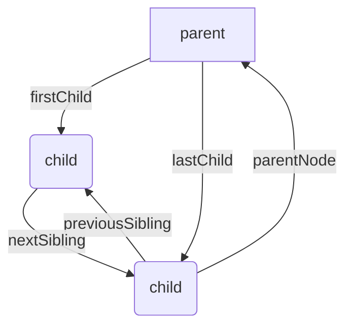
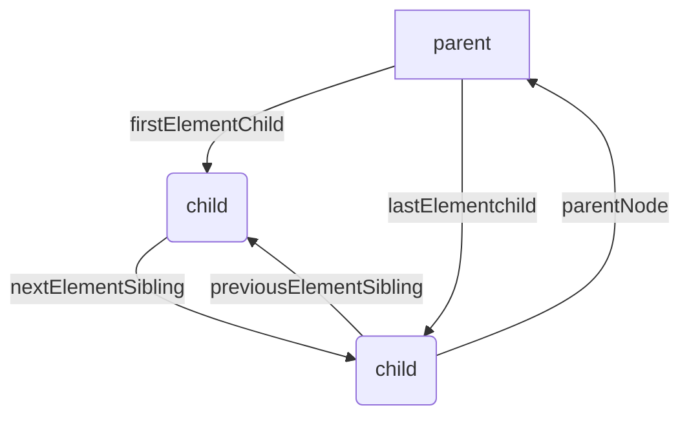

# DOM

> document 文档操作级别的最高对象

## 节点(元素)

### 创建节点

> 方法

-   `document.write()` 覆盖页面,在页面加载之前却不不会
-   `document.createElement(ele)` 创建标签节点
-   `document.createTextNode(ele)` 创建文本节点
-   `document.createDocumentFragment(ele)` 创建文本片段节点
-   `document.createComment(ele)` 创建文本注释节点

> 常用的创建方法

> `innerHTML()`

-   设置或获取当前标签起始和结束表里面的内容
-   最左边不能有空白
-   不能对 meta 标签操作
    > `innerText()`
-   设置或获取当前标签起始和结束表里面的文本内容
    > `outerHTML()`
-   获取当前标签起始和结束表里面的内容(包括自身)
-   设置会覆盖内容
    > `outerText()`
-   获取当前标签起始和结束表里面的内容(包括自身)
-   设置会导致上层元素内容消失(不推荐)

### 查找节点

> Node API

-   `owerDocumnet()` 直达根元素
-   `childNodes[]` or `childNodes.item()` 选择节点
-   `hasChildNodes()` 判断是否有子节点

> element API

-   `childElementChildCount` 元素的个数

### 节点查找

-   document.getElementById() 根据 id 查找 dom
-   document.getElementsByName() 根据 name 查找 dom
-   document.getElementsByTagName() 根据标签名查找 dom
-   document.getElementsByClassName() 根据类名查找 dom
-   document.querySelector() 万能选择器
-   document.querySelectorAll() 万能选择器 形成类数组

### 操作节点

-   appendChild() 添加节点
-   insertBefore(添加节点,插入节点的位置) 在指定位置插入节点
-   replaceChild(替换节点,被替换的节点) 替换节点
-   cloneNode(boolean) 克隆节点(为 true, 克隆子节点)
-   normalize() 合并文本节点(TextNode)
-   splitText(索引) 按照指定位置分隔

### 删除节点

-   removeChild(节点) 删除节点
-   removeNode(boolean) ie 专用 为 true 删除父子节点
-   innerHTML 赋值删除

## 属性

> 分为两种

-   固有属性(property)
-   自定义属性(Attribute)

### 固有属性

> 定义

-   浏览器定义好的属性,固有属性部分继承于父元素

> 方法

-   `.`法直接访问属性

### 自定义属性

> 定义

-   用户自定义的属性,常用 data-\*
    > 特点
-   在 js 中大写属性名,在 html 会自动转换为小写
-   通过 `NameNodeMap`对象操作
    > 方法
-   节点.attributes.getNameItem(name)
-   节点.attributes.removeNameItem(name)
-   节点.attributes.setNameItem(name,value)

常用的

-   节点.getAttribute(name)
-   节点.setAttribute(name,value)
-   节点.removeAttribute(name)

-   节点.dataset.value 获取`data-value`属性

### 常用属性

> 布尔属性
>
> -   checked 常用于`radio, checkbox` 勾选
> -   selected 常用域`option` 选中
> -   readonly 只读
> -   disabled 使表单元素失灵,不会提交 value
> -   multiple 使之多选
> -   hidden 不显示在页面

> 字符串属性
>
> -   id
> -   title 可见元素掠过的时候显示的文字
> -   href 超链接
> -   src 数据的来源
> -   lang 辅助设备,盲人
> -   dir 文本输出方向
> -   accesskey 组合键(快捷键) `alt+`
> -   name 表单
> -   value 表单
> -   class 样式类
> -   contentediable 是否可编辑元素
> -   tabindex 用 tab 导航
> -   translate 是否可以翻译

> 其他

> classlist.

-   add() 添加
-   remove() 删除
-   contain() 包含
-   toggle() 取反

### 类数组

1. 类数组对象,保存一组有序的节点
2. []用于访问, 有 item() 和 length 属性
3. 不是 Array 实例 , 没有数组方法,可以 for 循环
> NodeList 对象
* 通过nodeAPI获取
> HTMLCollection 对象
* 标签
* 脚本
* 链接
* 图片
* 表单
* 单元格(表格)
* select.option
> NameNodeMap 对象
* ele.attributes

> 类数组动态性
1. 基于dom结构的动态查询的结果,dom变化能自动反应到这些对象中
2. 结构发生变化时,都会得到更新
# BOM

## window对象
> 定义
* 浏览器的一个实例,在浏览器中 window是JavaScript访问浏览器窗口的一个接口,又是ECMAScript规定global对象

> 方法
* alert 弹出窗口
* confirm 弹框(确认,取消)
* prompt 输入值(true 值, false 返回null)
* open 新打开一个浏览器窗口
* close 关闭窗口
* setTimeout 超时调用
* clearTimeout 清除调用
* setInterval 间歇调用
* clearInterval 清除间歇调用

## location对象
> 定义
* 是document和window的属性,提供导航的功能,提供加载的文档有关的信息

> 方法
* href 返回完整的url
* hash 返回url中的hash
* host 返回服务器名称和端口号
* hostname 返回不带端口的服务器名称
* pathname 返回url中的目录和文件名
* port 端口号
* protcal 协议
* search ? 后的字符串
* replace 重新定向url(不会再历史记录中产生新纪录)
* reload(boolean) 重新加载页面,传(true) 从服务器重新加载,否则缓存加载

## history对象
> 定义
* 历史记录

> 方法
* back() 回到历史纪录的上一把
* go() -1 上一步 -2 上两步 1 下一步 2 下两步
* forward(num) 回到下num步

## screen 屏幕对象
> 定义
* 屏幕对象

> 方法
* availWidth() 可用宽度
* availHeight() 可用高度

## Navigator对象
> 返回 用户的操作系统,
* userAgent: 浏览器版本,版本, 引擎,操作系统

